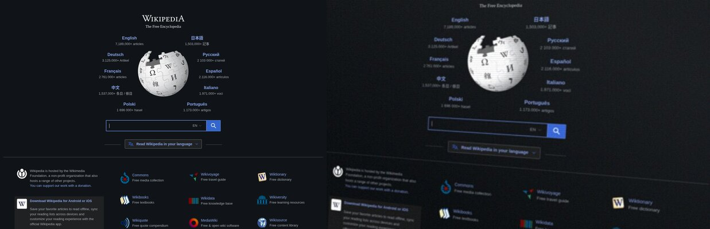

# Phoneshot 拍屏插件 📸

**English**: [README.md](README.md)

把清晰的截图，一键做旧成「手机拍屏幕」的效果 —— Omarchy 插件。



- `PRINT` 保持原生不动。做旧是面板里的动作：点栏图标 → 📱 → 选区 → 出图
- 效果：彩虹摩尔纹（传感器采样模型）+ LCD 亚像素光栅 + 扫描线 + 色散 +
  透视手抖 + 失焦 + 反光/快门横带 + 颗粒 + JPEG 二次压缩
- 输出 `*-phoneshot.jpg`，原清晰 PNG 也保留；做旧版进剪贴板
  （转投 PNG,Omarchy 剪贴板历史能记录）

## 安装

```bash
omarchy plugin add https://github.com/Duro02/omarchy-phoneshot --enable
```

装完即用，这就是全部安装步骤。仓库根就是合法插件
（`manifest.json` + `BarWidget.qml`),`plugin add` 会把整仓 clone 到
`~/.config/omarchy/plugins/duro.phoneshot/`；面板直接调插件目录里的脚本，
不需要 PATH 配置、不需要改快捷键。

以后更新用 `omarchy plugin update duro.phoneshot`。

## 用法

| 动作 | 效果 |
|------|------|
| 栏图标 → 「拍屏截图」 | 收起面板 → 选区 → 做旧图落盘 + 进剪贴板 |
| `PRINT` | 原生 Omarchy 截图，不受影响 |
| `PHONESHOT_LEVEL=hard omarchy-phoneshot-screenshot` | 单次重度做旧 |
| `omarchy-phoneshot-apply in.png out.jpg` | 只跑滤镜（脚本在插件目录 `bin/` 里；install.sh 会软链进 `~/.local/bin` 方便命令行调用） |

强度档位 `PHONESHOT_LEVEL`:`mild` / `mid`（默认）/ `hard`。

面板里五个滑杆 + 「随机一组参数」按钮。松手即重渲染预览——预览和真实
拍屏同一引擎同一参数。

想让 `PRINT` 也产出拍屏图？可选：把 `bindings-snippet.lua` 两行贴进
`~/.config/hypr/bindings.lua` 再 `hyprctl reload`。之后
`~/.config/omarchy/phoneshot-mode` 为 `on` 时做旧（`omarchy-phoneshot-toggle`
切换），`off` 时透传原生。

| 滑杆 | 范围 | 说明 |
|------|------|------|
| 旋转 | −5–+5° | 面内 roll，负=顺时针/正=逆时针 |
| 侧视 | −12–+12° | 梯形透视，正=右侧拍/负=左侧拍 |
| 失焦 | 0–2.0 | 对不上焦的均匀模糊（也会压掉摩尔纹） |
| 拖影 | 0–8px | 快门瞬间手抖的方向性重影 |
| 拖影方向 | 0–180° | 拖影朝向，0=横/90=竖 |

透视/旋转不会编造原图之外的像素：成品裁到只含原图内容的最大内接矩形，
输出尺寸略小于原图、随参数变化。

## 输出配置

`~/.config/omarchy/phoneshot-output`（全部字段可缺席）:

```
clipboard=phoneshot      # original | phoneshot | none
save_original=true
save_phoneshot=true
output_dir=              # 空 = 跟原生截图目录
level=mid                # mild | mid | hard
notify=true
```

显式 `copy` 强制不落盘、显式 `save` 强制不碰剪贴板；
做旧版既不存也不进剪贴板时直接跳过渲染。

## 界面语言

`~/.config/omarchy/phoneshot-lang` 写 `zh` 或 `en`，控制面板与通知文案。
install.sh 按系统 locale 落一次默认，改完 `omarchy restart shell` 生效。

## 卸载

```bash
omarchy plugin remove duro.phoneshot
rm ~/.local/bin/omarchy-phoneshot-*   # 跑过 install.sh 才有
```

如果贴过可选的两行绑定，从 `~/.config/hypr/bindings.lua` 删掉即可。
原生截图不受影响。

## 开发

本仓库是唯一源码：改完跑 `./install.sh`，再 `omarchy restart shell`。
设计决策与踩坑记录见 [DEVLOG.md](DEVLOG.md)。
